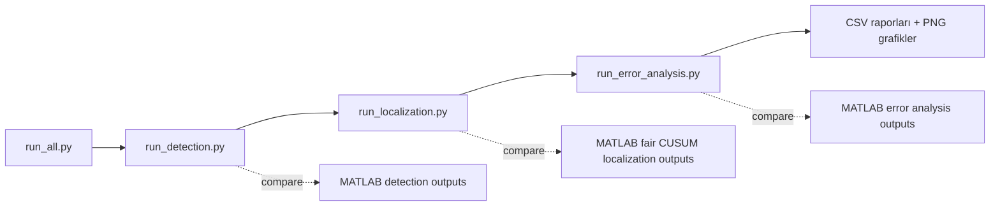
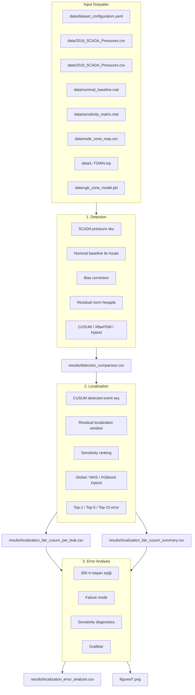
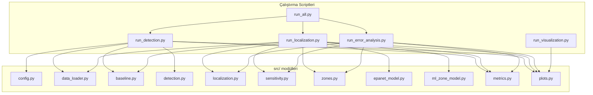
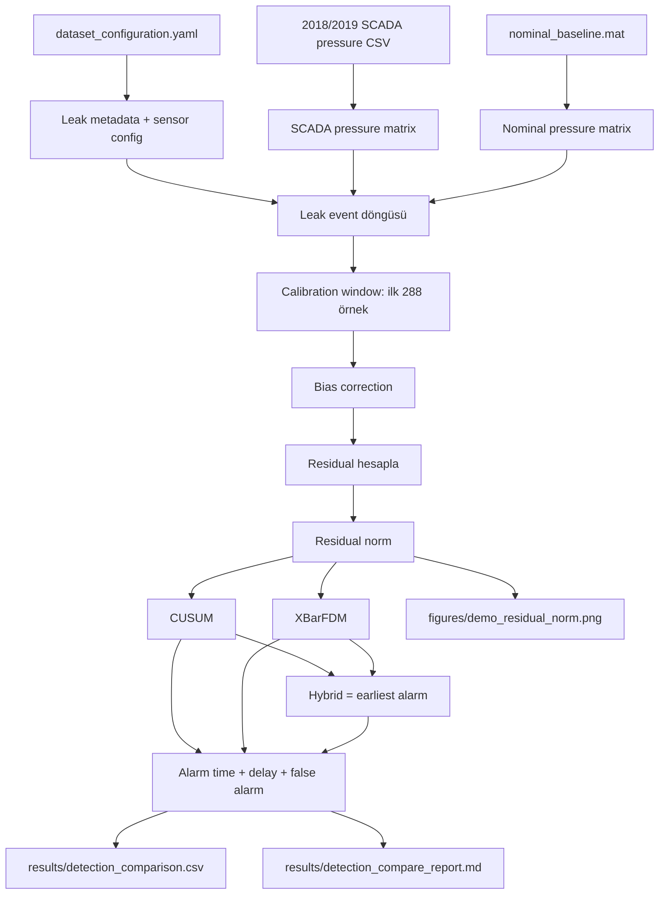
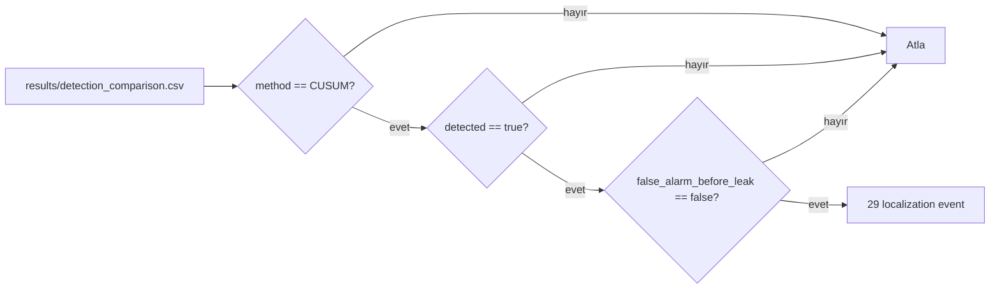
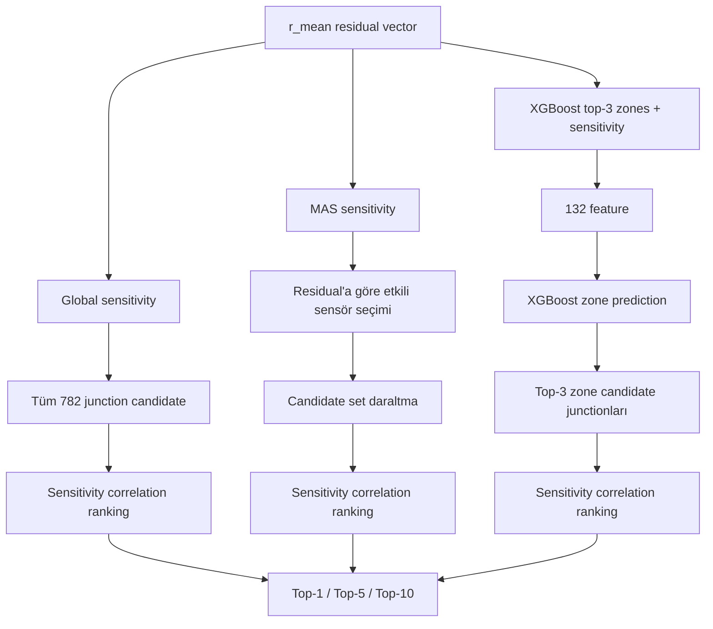
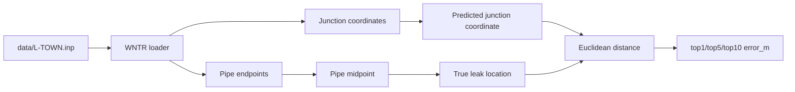
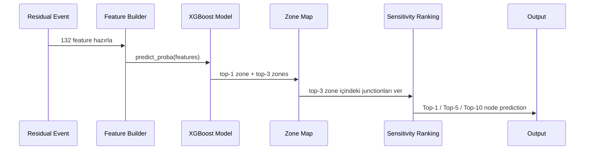
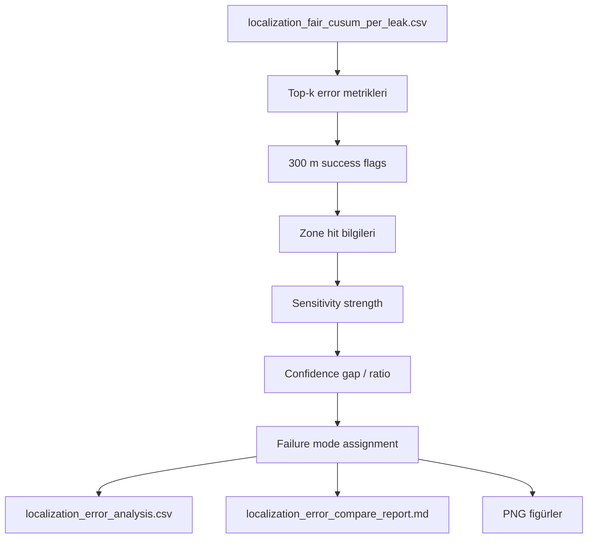
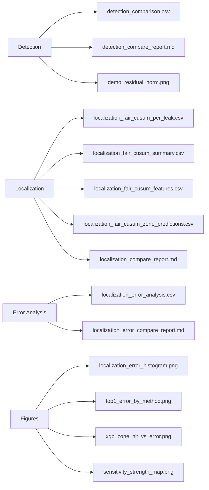

# HydroTwin Python Port — Görsel İş Akışı

Bu doküman, `python_port/` içindeki Python-only HydroTwin pipeline’ının **hangi sırayla çalıştığını**, **hangi dosyaların devreye girdiğini** ve **her aşamada hangi yöntemin kullanıldığını** görsel olarak anlatır.

> Önerilen yer: `python_port/WORKFLOW_VISUAL.md`

---

## 0. Tek Komutla Genel Akış

```powershell
py -3.12 python_port\run_all.py --compare-existing --plot
```



---

## 1. Büyük Resim: Veri → Detection → Localization → Error Analysis



---

## 2. Dosya Bazlı Çalışma Haritası



---

## 3. Detection İş Akışı

**Komut:**

```powershell
py -3.12 python_port\run_detection.py --method all --year both --compare-existing --plot-demo
```



| Yöntem | Ne yapar? | Durum |
|---|---|---|
| CUSUM | Küçük ama sürekli sapmaları kümülatif izler | Aktif |
| XBarFDM | Ortalama/sapma temelli alarm üretir | Aktif |
| Hybrid | CUSUM ve XBarFDM içinde erken alarm vereni seçer | Aktif |
| PlanC | Eski deneysel yöntem | Çıkarıldı |

> PlanC final pipeline’da yoktur. CLI seçeneği, aktif detector ve final CSV yöntemi değildir.

---

## 4. Localization İş Akışı

**Komut:**

```powershell
py -3.12 python_port\run_localization.py --method all --use-python-detection --threshold-m 300 --compare-existing --plot
```

Localization sadece güvenilir CUSUM eventlerini kullanır:

```text
method == "CUSUM"
detected == true
false_alarm_before_leak == false
```



---

## 5. Residual Window ve Sensitivity Ranking

```mermaid
flowchart TD
    A[Leak start öncesi 1 gün] --> B[Calibration window: 288 örnek]
    B --> C[Bias = mean(P_measured - P_nominal)]
    C --> D[Residual = P_nominal + bias - P_measured]
    D --> E[Alarm sonrası localization window: 288 örnek]
    E --> F[r_mean: 33 sensörlük residual vector]
    F --> G[r_norm = r_mean / norm(r_mean)]
    G --> H[score = S_norm.T @ r_norm]
    H --> I[Junction ranking]
    I --> J[Top-1 / Top-5 / Top-10]
```

| Özellik | Değer |
|---|---:|
| Pressure sensor sayısı | 33 |
| Junction candidate sayısı | 782 |
| `S` shape | `(33, 782)` |
| `S_norm` shape | `(33, 782)` |

---

## 6. Localization Yöntemleri



| Yöntem | Candidate alanı | Mantık |
|---|---:|---|
| Global sensitivity | 782 junction | Tüm ağı arar |
| MAS sensitivity | Ortalama ~78 junction | Sensör etkisine göre arama alanını daraltır |
| XGBoost top-3 zones + sensitivity | Top-3 zone junctionları | Önce zone tahmini, sonra sensitivity ranking |

---

## 7. EPANET / L-TOWN Mapping

`src/epanet_model.py`, `data/L-TOWN.inp` dosyasını WNTR ile okur.



```text
true leak location = pipe midpoint
predicted location = predicted junction coordinate
error = EuclideanDistance(predicted junction, true pipe midpoint)
threshold = 300 m
```

---

## 8. XGBoost Hybrid Detayı



```text
Model: data/xgb_zone_model.pkl
Kullanım: predict-only
Training: yapılmaz
```

---

## 9. Error Analysis Akışı

**Komut:**

```powershell
py -3.12 python_port\run_error_analysis.py --compare-existing --plot --threshold-m 300
```



| Failure mode | Anlamı |
|---|---|
| `success_within_300m` | Tahmin 300 m içinde başarılı |
| `weak_sensitivity` | Sensitivity sinyali zayıf |
| `wrong_zone` | XGBoost zone tahmini yanlış |
| `low_confidence` | Skor farkı/güven düşük |
| `candidate_filter_miss` | Doğru bölge candidate filtreye girmemiş |
| `large_distance_error` | Tahmin ciddi uzak |
| `unknown` | Net sınıfa girmeyen durum |

---

## 10. Üretilen Çıktılar



---

## 11. Sonuç Özeti

| Aşama | Method | Durum |
|---|---|---|
| Detection | CUSUM | Aktif |
| Detection | XBarFDM | Aktif |
| Detection | Hybrid = earliest(CUSUM, XBarFDM) | Aktif |
| Detection | PlanC | Çıkarıldı |
| Localization | Global sensitivity | Aktif, 29 leak |
| Localization | MAS sensitivity | Aktif, 29 leak |
| Localization | XGBoost top-3 zones + sensitivity | Aktif, 29 leak |

---

## 12. Hocaya 60 Saniyelik Anlatım

> MATLAB/Simulink ağırlıklı HydroTwin L-TOWN kaçak tespit ve konumlandırma hattını Python-only hale getirdim. Detection tarafında SCADA pressure verileri nominal baseline ile karşılaştırılıyor, residual norm üzerinden CUSUM, XBarFDM ve Hybrid detector çalışıyor. Localization tarafında sadece güvenilir CUSUM eventleri seçiliyor. Sonra Global sensitivity, MAS sensitivity ve XGBoost top-3 zones + sensitivity yöntemleriyle kaçak konumu tahmin ediliyor. Gerçek konum pipe midpoint olarak alınıyor, tahmin edilen junction ile arasındaki Euclidean mesafe hesaplanıyor ve 300 metre başarı eşiğiyle değerlendiriliyor. Python çıktıları MATLAB sonuçlarıyla floating point seviyesinde eşleşiyor.

---

## 13. Demo Sırası

1. `README.md` açılır.
2. `WORKFLOW_VISUAL.md` içindeki genel akış diyagramı gösterilir.
3. Terminalde uçtan uca pipeline çalıştırılır:

```powershell
py -3.12 python_port\run_all.py --compare-existing --plot
```

4. Şu dosyalar gösterilir:

```text
python_port/results/detection_compare_report.md
python_port/results/localization_compare_report.md
python_port/results/localization_fair_cusum_summary.csv
python_port/results/localization_error_analysis.csv
python_port/figures/top1_error_by_method.png
python_port/figures/localization_error_histogram.png
python_port/figures/xgb_zone_hit_vs_error.png
```

5. Son cümle:

> MATLAB dosyaları korunarak Python tarafında ayrı ve çalıştırılabilir bir port oluşturuldu. Pipeline tek komutla çalışıyor ve mevcut MATLAB çıktılarıyla karşılaştırma raporları üretiyor.
